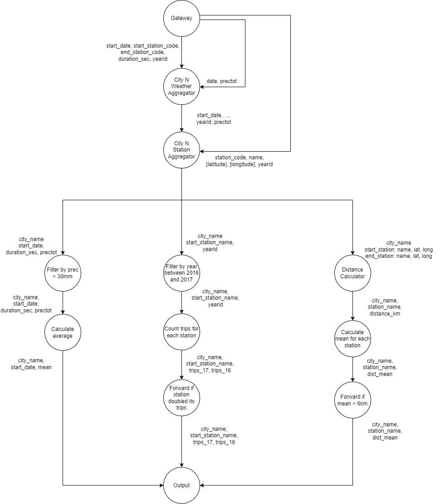
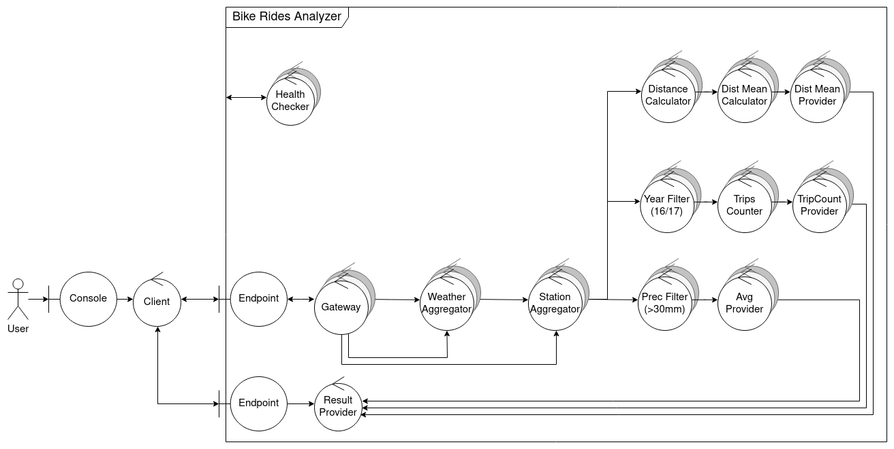
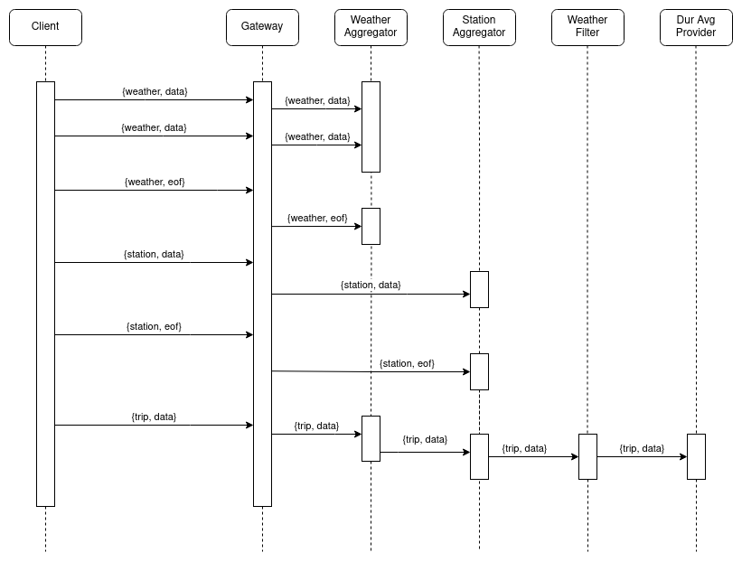

# TP1 - Sistemas Distribuidos I

## Tabla de contenidos

- [TP1 - Sistemas Distribuidos I](#tp1---sistemas-distribuidos-i)
  - [Tabla de contenidos](#tabla-de-contenidos)
  - [Ejecución](#ejecución)
    - [Requisitos](#requisitos)
    - [Parametros del sistema](#parametros-del-sistema)
    - [Ejecución del sistema](#ejecución-del-sistema)
  - [Documentación](#documentación)
    - [Alcance](#alcance)
    - [Arquitectura de Software](#arquitectura-de-software)
    - [Objetivos y limitaciones arquitectónicas](#objetivos-y-limitaciones-arquitectónicas)
    - [Escenarios](#escenarios)
    - [Vista Lógica](#vista-lógica)
      - [DAG](#dag)
    - [Vista Física](#vista-física)
      - [Diagrama de robustez](#diagrama-de-robustez)
      - [Sincronización de EOFs](#sincronización-de-eofs)
      - [Diagrama de despliegue](#diagrama-de-despliegue)
    - [Vista de Procesos](#vista-de-procesos)
      - [Diagrama de actividad](#diagrama-de-actividad)
      - [Diagrama de secuencia](#diagrama-de-secuencia)
    - [Vista de Desarrollo](#vista-de-desarrollo)
      - [Diagrama de paquetes](#diagrama-de-paquetes)
    - [Vista Lógica](#vista-lógica-1)
      - [Diagrama de clases](#diagrama-de-clases)

## Ejecución

### Requisitos

Para ejecutar el sistema, se debe crear una carpeta `.data` en la raíz del proyecto, y colocar
las carpetas con los archivos de cada ciudad (`trips.csv`, `stations.csv`, `weather.csv`).

El directorio debe tener la siguiente estructura:

```
.data
├── montreal
│   ├── stations.csv
│   ├── trips.csv
│   └── weather.csv
├── toronto
│   ├── stations.csv
│   ├── trips.csv
│   └── weather.csv
└── washington
    ├── stations.csv
    ├── trips.csv
    └── weather.csv
```

### Parametros del sistema

Podemos encontrar y editar las variables principales del sistema en el archivo `deployment.json`. Su contenido luego sera plasmado en el docker-compose al levantar el sistema (o al correr `scripts/build.py`).

Dentro de este archivo podemos encontrar y editar:
- La cantidad de nodos de cada tipo
- Sus variables de entorno
- Como se conectan entre si

Ademas, podemos predefinir procesos clientes, definiendo:
- Su nombre
- El directorio del que obtendar los archivos
- Las ciudades por las que consultaran

### Ejecución del sistema

Utilizando el `Makefile` se puede ejecutar el sistema de forma sencilla. Algunos de los comandos disponibles son:

- `make`: levanta el sistema y muestra los logs
- `make up`: levanta el sistema
- `make logs`: muestra los logs del sistema
- `make down`: detiene el sistema

## Documentación

### Alcance

El proyecto consiste en un sistema distribuido que analice los registros de viajes
realizados con bicicletas de la red pública provista por grandes ciudades.

Se deben generar los siguientes reportes:

- La duración promedio de viajes que iniciaron en días con
  precipitaciones >30mm.
- Los nombres de estaciones que al menos duplicaron la cantidad de
  viajes iniciados en ellas entre 2016 y el 2017.
- Los nombres de estaciones de Montreal para la que el promedio de
  los ciclistas recorren más de 6km en llegar a ellas.

### Arquitectura de Software

La arquitectura consiste en un cliente, que se comunica con un sistema distribuido
mediante sockets ZMQ. El sistema procesa la información recibida utilizando RabbitMQ como
broker de mensajes.

### Objetivos y limitaciones arquitectónicas

- **Escalabilidad**: Se debe soportar el incremento de los elementos de cómputo para
  escalar los volúmenes de información a procesar.
- **Mantenibilidad**: La comunicación de grupos debe encapsularse en un middleware.

### Escenarios


Diagrama de casos de uso del sistema.

### Vista Lógica

#### DAG



DAG global del sistema.

En el diagrama se puede observar la división de responsabilidades entre los distintos componentes
del sistema. En primer lugar, el Gateway se encarga de distribuir la información recibida del cliente,
entre los aggregators. Cada aggregator opera con una side table que contiene un pequeño conjunto de
datos estáticos.

Para disminuir el tamaño de los mensajes que debe procesar RabbitMQ, el Gateway poda todos los
campos que no son necesarios para calcular los reportes.
Por ejemplo, el Gateway recibe una gran cantidad de información climática, pero el sistema solo
necesita la precipitación. Por lo tanto, el Gateway elimina todos los campos que no son necesarios
antes de enviar la información al aggregator.

La información de las side tables se ingresa al sistema mediante un mecanismo de pub-sub, para
permitir que varias réplicas de los aggregators puedan construir sus side tables.
Esto favorece la escalabilidad del sistema, a costa de duplicar la información en cada réplica.

### Vista Física

#### Diagrama de robustez



Diagrama de robustez simplificado

Como se puede ver, varias entidades del sistema pueden ser replicadas, para permitir un escalado
horizontal.

El cliente se comunica con el sistema a través de dos endpoints: uno para enviar la información (`Gateway`),
y otro para recibir los reportes (`Result Provider`). En ambos casos, la comunicación se realiza mediante
sockets ZMQ.
Dentro del sistema `Bike Rides Analyzer`, la comunicación se realiza mediante RabbitMQ.

Algunas entidades poseen el estereotipo `<<City Affinity>>`. Esto quiere decir que, para dicha entidad,
existirá un nodo por cada ciudad. Por ejemplo, se deben desplegar tres instancias de `Weather Aggregator`.

Los aggregators, además de tener affinity con una ciudad, pueden replicarse. Por ejemplo, pueden desplegarse
3 `Weather Aggregator` para Washington, y 2 `Weather Aggregator` para Montreal.


Diagramas de robustez detallados, con información de las queues que se utilizan para comunicar las distintas
etapas del pipeline.

En los anteriores se observa la forma en que se distribuyen los mensajes entre los distintos
componentes del sistema. Además, se puede ver el mecanismo por el cual se dividen los mensajes en aquellos
nodos que poseen `<<City Affinity>>`: el nombre de la queue inicia con el nombre de la ciudad, seguido de un
guion bajo.

Por otro lado, se puede observar la forma en que se distribuye el trabajo entre las diferentes réplicas de
cada nodo. Cada réplica tiene su propia queue, y se utiliza una función de hashing para determinar a qué
réplica se le envía cada mensaje.

#### Sincronización de EOFs


Diagrama de sincronización entre las distintas etapas del pipeline.

Para evitar condiciones de carrera al momento de recibir un EOF de parte del cliente, se definió un
nodo `Synchronizer`. Cuando una réplica de un nodo recibe un EOF, envía un mensaje al Synchronizer.
Una vez que el Synchronizer recibe un EOF de cada réplica, envía un EOF a todas las réplicas de la
siguiente etapa del pipeline. Este mensaje se envía a la misma queue que se utiliza para enviar los
datos de procesamiento, por lo que se garantiza que el EOF se encolará luego de que todos los datos
estén encolados.

#### Diagrama de despliegue


Diagrama de despliegue del sistema.

Este diagrama pone en evidencia la fuerte dependencia que existe entre RabbitMQ (Message Queue) y
los diferentes componentes del sistema.
Para alivianar la carga del broker, el cliente se comunica directamente con el Gateway y el Result Provider.
Cada nodo puede desplegarse de manera independiente.

### Vista de Procesos

#### Diagrama de actividad


Diagrama de actividad de la comunicación entre el cliente, el Gateway y el primer aggregator

En el diagrama anterior se puede observar el orden en que el cliente envía la información al Gateway, y
el orden en que la esperan los aggregators.
Por un lado, el cliente envía la información del clima, estaciones y viajes.
El `Weather Aggregator` necesita la información climática para armar su side table, por lo que no puede
procesar la información de los viajes hasta que no reciba todos los datos del clima.
Lo mismo sucede con el `Station Aggregator`, que necesita la información de las estaciones.

El cliente envía la información de cada ciudad en un thread separado.


Diagrama de actividad de la comunicación del `Station Aggregator` con el `Prec Filter` y `Result Provider`.

En el diagrama se visualiza cómo se comunica la información, desde el momento en que se termina de agregar
la información de las estaciones y el clima, hasta que se envía al primer conjunto de filtros y calculators.

Se puede ver que el `Prec Filter` puede realizar su trabajo utilizando
exclusivamente la información del paquete que acaban de recibir, por lo que el escalado de éstas entidades
es muy sencillo. Lo mismo ocurre con `Year Filter`, `Trip Count Provider`, `Distance Calculator` y `Dist Mean Provider`.

El `Result Provider` se encarga de comunicarle al cliente la información de los reportes.

#### Diagrama de secuencia



Diagrama de secuencia de un posible envio de datos del cliente al sistema.

En el diagrama se observa con más detalle el camino que recorre la información desde el cliente hasta
cada uno de los nodos del sistema. A modo de ejemplo, se enviaron solo dos mensajes con información
de clima, uno de estaciones y uno de viajes, junto con los EOFs correspondientes.
En un caso real, se enviarían muchos más mensajes de tipo `data`.

Los mensajes tipo EOF deben ser enviados al Synchronizer, para que los retenga hasta que todas las
réplicas de un nodo hayan terminado de procesar los datos.


Diagrama de secuencia de la obtención de los reportes por parte del cliente.

Para obtener los resultados, el cliente le envía un mensaje al `Result Provider`.
El `Result Provider`, al recibirlo, toma de la queue correspondiente un mensaje, que es
reenviado inmediatamente al cliente.
Si este mensaje es un EOF, el cliente sabe que ya recibió todos los resultados para un
conjunto dado de (ciudad, reporte)

### Vista de Desarrollo

#### Diagrama de paquetes


Diagrama de paquetes ilustrativo del sistema.

En el diagrama se observa, a modo de ejemplo, la estructura de paquetes del
`Weather Filter`, aunque es muy similar al resto de los componentes del sistema.

Tanto el `BasicFilter` como el `WeatherFilter` utilizan la abstracción `Rabbit Middleware`
para no depender de los detalles de implementación de la biblioteca pika.

### Vista Lógica

#### Diagrama de clases


Diagrama de clases de los filtros, aggregators y el synchronizer.

La forma en que se implementan estos tres tipos de componentes es muy similar:
se define una clase que hereda de `BasicFilter`, `BasicAggregator` o `Synchronizer`,
y se implementa el método `handle_message`, que se ejecuta cada vez que se recibe un mensaje.
El retorno de este método es un conjunto de mensajes que se deben enviar a la siguiente etapa.

Esta abstracción permite implementar envio de batches de mensajes desde la clase abstracta, sin
que las clases concretas tengan que preocuparse por ello.


