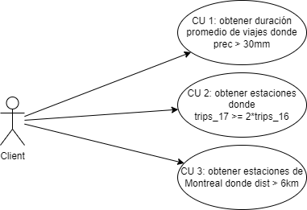
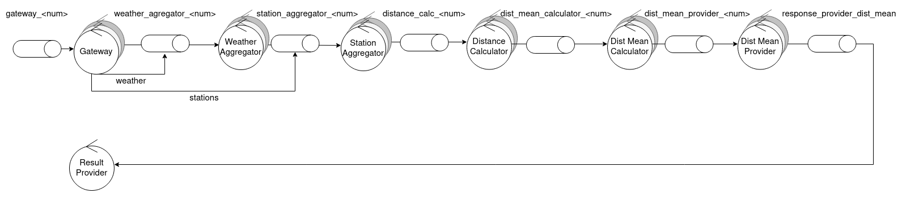
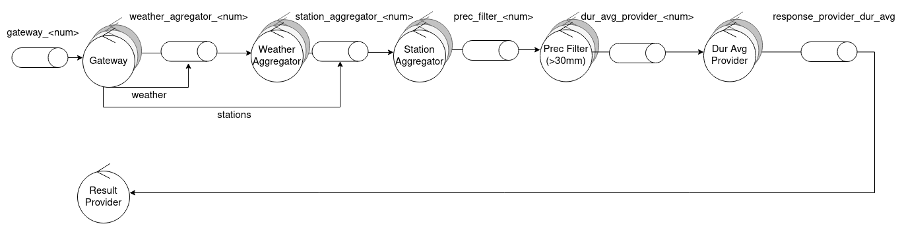
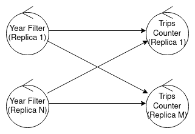
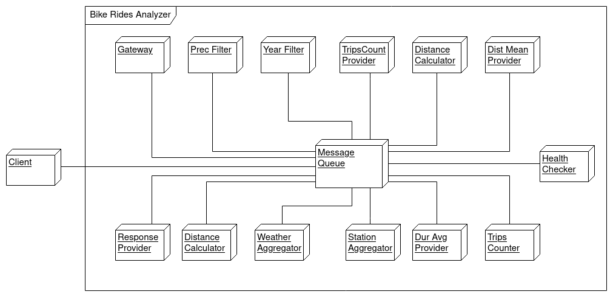
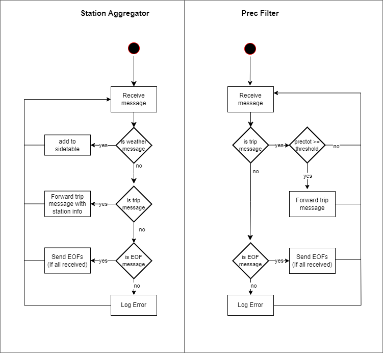
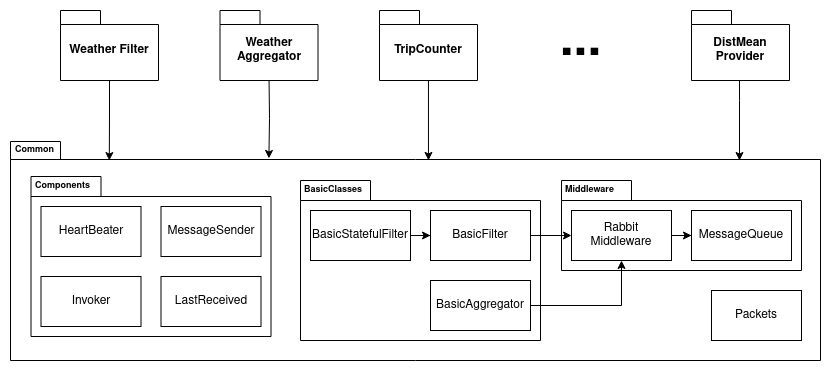
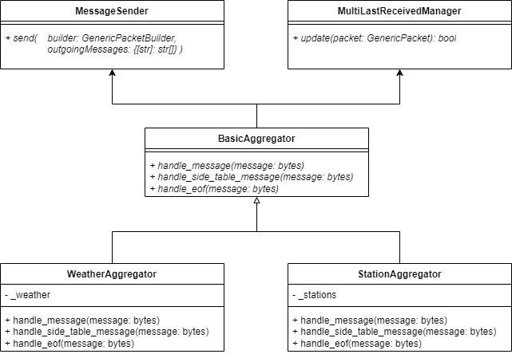
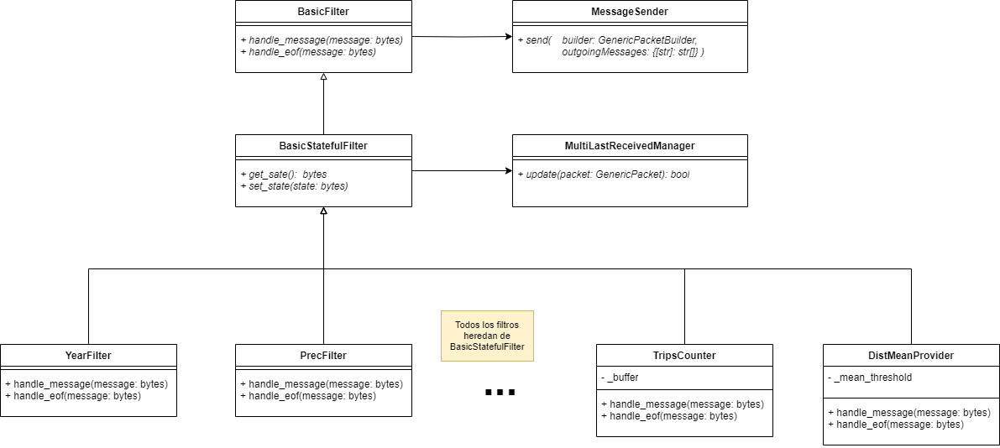

# TP1 - Sistemas Distribuidos I

## Tabla de contenidos

- [TP1 - Sistemas Distribuidos I](#tp1---sistemas-distribuidos-i)
  - [Tabla de contenidos](#tabla-de-contenidos)
  - [Ejecución](#ejecución)
    - [Requisitos](#requisitos)
    - [Parámetros del sistema](#parámetros-del-sistema)
    - [Ejecución del sistema](#ejecución-del-sistema)
  - [Documentación](#documentación)
    - [Alcance](#alcance)
    - [Arquitectura de Software](#arquitectura-de-software)
    - [Objetivos y limitaciones arquitectónicas](#objetivos-y-limitaciones-arquitectónicas)
    - [Escenarios](#escenarios)
      - [Caso de Uso 1 (CU 1)](#caso-de-uso-1-cu-1)
      - [Caso de Uso 2 (CU 2)](#caso-de-uso-2-cu-2)
      - [Caso de Uso 3 (CU 3)](#caso-de-uso-3-cu-3)
    - [Vista Lógica](#vista-lógica)
      - [DAG](#dag)
    - [Vista Física](#vista-física)
      - [Diagrama de robustez](#diagrama-de-robustez)
      - [Sincronización de EOFs](#sincronización-de-eofs)
      - [Diagrama de despliegue](#diagrama-de-despliegue)
    - [Vista de Procesos](#vista-de-procesos)
      - [Diagrama de actividad](#diagrama-de-actividad)
      - [Diagrama de secuencia](#diagrama-de-secuencia)
    - [Vista de Desarrollo](#vista-de-desarrollo)
      - [Diagrama de paquetes](#diagrama-de-paquetes)
    - [Vista Lógica](#vista-lógica-1)
      - [Diagrama de clases](#diagrama-de-clases)
  - [Alta Disponibilidad y Tolerancia a Fallos](#alta-disponibilidad-y-tolerancia-a-fallos)
    - [Nuevos requerimientos](#nuevos-requerimientos)
    - [Tolerancia a Fallos](#tolerancia-a-fallos)
    - [Filtrado Mensajes Repetidos](#filtrado-mensajes-repetidos)
    - [Envío de resultados sin repetidos](#envío-de-resultados-sin-repetidos)
    - [Health check del sistema](#health-check-del-sistema)
    - [Health check de los clientes](#health-check-de-los-clientes)
    - [Control de velocidad de envio](#control-de-velocidad-de-envio)

## Ejecución

### Requisitos

Para ejecutar el sistema, se debe crear una carpeta `.data` en la raíz del proyecto, y colocar
las carpetas con los archivos de cada ciudad (`trips.csv`, `stations.csv`, `weather.csv`).

El directorio debe tener la siguiente estructura:

```
.data
├── montreal
│   ├── stations.csv
│   ├── trips.csv
│   └── weather.csv
├── toronto
│   ├── stations.csv
│   ├── trips.csv
│   └── weather.csv
└── washington
    ├── stations.csv
    ├── trips.csv
    └── weather.csv
```

### Parámetros del sistema

Podemos encontrar y editar las variables principales del sistema en el archivo `deployment.json`. Su contenido luego
sera plasmado en el docker-compose al levantar el sistema (o al correr `scripts/build.py`).

Dentro de este archivo podemos encontrar y editar:

- La cantidad de nodos de cada tipo
- Sus variables de entorno
- Como se conectan entre sí

Además, podemos predefinir procesos clientes, definiendo:

- Su nombre
- El directorio del que obtendrá los archivos
- Las ciudades por las que consultarán

### Ejecución del sistema

Utilizando el `Makefile` se puede ejecutar el sistema de forma sencilla. Algunos de los comandos disponibles son:

- `make`: levanta el sistema y muestra los logs
- `make up`: levanta el sistema
- `make logs`: muestra los logs del sistema
- `make down`: detiene el sistema

## Documentación

### Alcance

El proyecto consiste en un sistema distribuido que analice los registros de viajes
realizados con bicicletas de la red pública provista por grandes ciudades.

Se deben generar los siguientes reportes:

- La duración promedio de viajes que iniciaron en días con
  precipitaciones >30mm.
- Los nombres de estaciones que al menos duplicaron la cantidad de
  viajes iniciados en ellas entre 2016 y el 2017.
- Los nombres de estaciones de Montreal para la que el promedio de
  los ciclistas recorren más de 6 km en llegar a ellas.

Además, el sistema debe permitir la ejecución de múltiples análisis en paralelo y/o en secuencia sin reiniciarlo.

### Arquitectura de Software

La arquitectura está compuesta por multiples nodos de diferentes tipos que se distribuyen el trabajo y responsabilidades
del sistema.
Toda la comunicación entre nodos se realiza mediante RabbitMQ.
Los clientes enviarán sus peticiones a un `Gateway`, pudiendo recibir mensajes de control de este, y recibiran sus
respuestas de un `ResponseProvider`.

> Pueden verse en más detalle los componentes del sistema en la [vista física](#vista-física).

### Objetivos y limitaciones arquitectónicas

- **Escalabilidad**: Se debe soportar el incremento de los elementos de cómputo para
  escalar los volúmenes de información a procesar.
- **Mantenibilidad**: La comunicación de grupos debe encapsularse en un middleware.
- **Tolerancia a fallas**: El sistema debe ser tolerante a fallas y caidas de los nodos.
- **Alta disponibilidad**: El sistema debe estar altamente disponible para los clientes.

### Escenarios



Diagrama de casos de uso del sistema.

#### Caso de Uso 1 (CU 1)

- Titulo: Obtener duración promedio de viajes donde prec > 30mm
- Actor: Cliente
- Pasos
    - Cliente: envia información de las ciudades a procesar
    - Sistema: procesa la información y envia los reportes al cliente
    - Cliente: recibe la duracion de viaje promedio en dias con precipitaciones mayores a 30mm

#### Caso de Uso 2 (CU 2)

- Título: Obtener estaciones donde trips_17 >= 2 * trips_16
- Actor: Cliente
- Pasos
    - Cliente: envia información de las ciudades a procesar
    - Sistema: procesa la información y envia los reportes al cliente
    - Cliente: recibe las estaciones que duplicaron la cantidad de viajes iniciados en ellas
      entre 2016 y el 2017

#### Caso de Uso 3 (CU 3)

- Título: Obtener estaciones de Montreal donde dist > 6km
- Actor: Cliente
- Pasos
    - Cliente: envia información de las ciudades a procesar
    - Sistema: procesa la información y envia los reportes al cliente
    - Cliente: recibe las estaciones de Montreal para la que el promedio de los ciclistas recorren
      más de 6 km en llegar a ellas

### Vista Lógica

#### DAG


DAG global del sistema.

En el diagrama se puede observar la división de responsabilidades entre los distintos componentes
del sistema. En primer lugar, el Gateway se encarga de distribuir la información recibida del cliente,
entre los aggregators. Cada aggregator opera con una side table que contiene un conjunto de
datos estáticos.

Para disminuir el tamaño de los mensajes que debe procesar RabbitMQ, el Gateway poda todos los
campos que no son necesarios para calcular los reportes.
Por ejemplo, el Gateway recibe una gran cantidad de información climática, pero el sistema solo
necesita la precipitación. Por lo tanto, el Gateway elimina todos los campos que no son necesarios
antes de enviar la información al aggregator.

La información de las side tables se ingresa al sistema mediante un mecanismo de pub-sub, para
permitir que todas las réplicas de los aggregators puedan construir sus side tables.
Esto favorece la escalabilidad del sistema, a costa de duplicar la información en cada réplica.

### Vista Física

#### Diagrama de robustez


Diagrama de robustez simplificado

Como se puede ver, varias entidades del sistema pueden ser replicadas, para permitir un escalado
horizontal.

El cliente se comunica con el sistema a través de dos endpoints: uno para enviar la información (`Gateway`),
y otro para recibir los reportes (`Result Provider`). En ambos casos, la comunicación se realiza mediante
RabbitMQ.
Dentro del sistema `Bike Rides Analyzer`, la comunicación también se realiza mediante RabbitMQ.






Diagrama de robustez detallado, con información de las queues que se utilizan para comunicar las distintas
etapas del pipeline.

Cada réplica tiene su propia queue, y se utiliza una función de hashing para determinar a qué réplica se le envía cada
mensaje.

Siendo el response provider la única excepción, que tiene una queue para cada flujo de resultados.

#### Sincronización de EOFs



Diagrama de sincronización entre las distintas etapas del pipeline.

Para evitar condiciones de carrera al momento de recibir un EOF de parte del cliente, se definió un
protocolo de manejo de EOFs (End Of File).

Para propagar un EOF de una etapa a la siguiente, todos los nodos de previos deben enviar un EOF a
todos los siguientes.

El mecanismo de envio a todos se hace mediante un fanout exchange; donde por ejemplo:
La routing key `trips_counter` publica mensajes a todos los trip counter (con colas `trip_counter_<num>`)

#### Diagrama de despliegue



Diagrama de despliegue del sistema.

Este diagrama pone en evidencia la fuerte dependencia que existe entre RabbitMQ (Message Queue) y
los diferentes componentes del sistema.
Cada nodo puede desplegarse de manera independiente.

### Vista de Procesos

#### Diagrama de actividad


Diagrama de actividad de la comunicación entre el cliente, el Gateway y el primer aggregator

En el diagrama anterior se puede observar el orden en que el cliente envía la información al Gateway, y
el orden en que la esperan los aggregators.
Por un lado, el cliente envía la información del clima, estaciones y luego viajes.
El `Weather Aggregator` necesita la información climática para armar su side table, por lo que no puede
procesar la información de los viajes hasta que no reciba todos los datos del clima.
Lo mismo sucede con el `Station Aggregator`, que necesita la información de las estaciones.

El cliente envía la información de cada ciudad de manera secuencial.
Si quisiera enviar la información en paralelo, debería correr otra instancia del cliente.



Diagrama de actividad de la comunicación del `Station Aggregator` con el `Prec Filter`.

En el diagrama se visualiza cómo se comunica la información, desde el momento en que se termina de agregar
la información de las estaciones y el clima, hasta que se envía al primer conjunto de filtros y calculators.

Se puede ver que el `Prec Filter` puede realizar su trabajo utilizando
exclusivamente la información del paquete que acaban de recibir, por lo que el escalado de éstas entidades
es muy sencillo. Lo mismo ocurre con `Year Filter`, `Trip Count Provider`, `Distance Calculator` y `Dist Mean Provider`.

#### Diagrama de secuencia


Diagrama de secuencia de un posible envio de datos del cliente al sistema.

El diagrama presentado es una version simplificada, no estándar, de un diagrama de secuencia.
Se decidió utilizar este formato para evitar saturarlo con demasiada información.

Con esto se busca mostrar el camino que recorre la información que ingresa el cliente:
se ve que primero es recibida por el `Gateway`, prácticamente sin modificaciones con respecto a los
archivos originales. Luego, el `Gateway` se encarga de descartar los campos innecesarios, y de enviar
los paquetes con la información correspondiente al `Weather Aggregator` y al `Station Aggregator`.
Una vez enviada la información de clima y estaciones, el cliente comienza a enviar la información de viajes.
Los aggregators, con sus side tables ya completas, agregan los campos necesarios a los paquetes, y los
envían a la siguiente etapa del pipeline.

A modo de ejemplo, se enviaron solo dos mensajes con información
de clima, uno de estaciones y uno de viajes, junto con los EOFs correspondientes.
En un caso real, se enviarían muchos más mensajes de tipo `data`.

Los mensajes tipo EOF deben ser enviados a todas las replicas del siguiente nodo,
que los almacenaran hasta recibir de todas las replicas del nodo anterior.

### Vista de Desarrollo

#### Diagrama de paquetes



Diagrama de paquetes simplificado del sistema.

En el diagrama se observa, la estructura de paquetes del sistema,
los nodos particulares tienen poca logica de negocio y aprovechan en gran medida codigo comun.

Tanto el `BasicFilter` como el `WeatherFilter` utilizan la abstracción `Rabbit Middleware`
para no depender de los detalles de implementación de la biblioteca pika.

`Message Queue` define una interfaz que debe ser implementada para poder utilizar un middleware
en el sistema. En nuestro caso, la implementación es utilizando pika, por lo que se define la clase
`Rabbit Middleware`, que hereda de `Message Queue`, e implementa los métodos de la interfaz,
ocultando los detalles de implementación de pika.

### Vista Lógica

#### Diagrama de clases





Diagrama de clases de los filtros y aggregators.

La forma en que se implementan estos componentes es muy similar:
se define una clase que hereda de `BasicFilter` o `BasicAggregator`,
y se implementa el método `handle_message`, que se ejecuta cada vez que se recibe un mensaje.
El retorno de este método es un conjunto de mensajes que se deben enviar a la siguiente etapa.

Esta abstracción permite implementar envio de batches de mensajes desde la clase abstracta, sin
que las clases concretas tengan que preocuparse por ello.

Ademas, puede redefinirse el método `handle_eof`, para realizar acciones al momento de recibir un EOF.
este tiene un funcionamento similar, retornando un conjunto de mensajes que se deben enviar a la siguiente etapa.
De este modo los filtros que acumulan, como `trips_counter`, pueden ser umplementados facilmente

Tambien podemos ver la composicion de las clases `MessageSender`, que se encarga del envio de mensajes,
y `MultiLastReceivedManager`, que se encarga de detectar duplicados.

## Alta Disponibilidad y Tolerancia a Fallos

### Nuevos requerimientos

- El sistema debe mostrar alta disponibilidad hacia los clientes
  > Se utiliza rabbitmq para la comunicación entre los clientes y el sistema, de modo que el cliente siempre puede enviar (y recibir) mensajes.
  >
  > Además, mediante la recuperación ante fallos nos aseguramos que el sistema esté altamente disponible.
  >
  > \*No hay garantías en cuanto a tiempo de respuesta
- El sistema debe ser tolerante a fallos por caídas de proceso
  > Se utiliza un cluster de ‘health checkers’ que monitorean el estado de todos los nodos del sistema y los ‘reviven’ si fuese necesario
- El sistema debe permitir la ejecución de múltiples análisis en paralelo y/o en secuencia sin reiniciarlo.
  > El sistema funciona de manera continua, múltiples clientes pueden generar peticiones en diferentes momentos y pueden ser procesados de manera paralela. Los nodos del sistema pueden escalar horizontalmente para distribuir la carga.
  > 
  > Se prevé la limpieza de datos con la finalización de un flujo, ya sea correcta o por desconexión del cliente. También se tiene en cuenta la diferenciación entre iteraciones de un mismo cliente.
- En caso de usar un algoritmo de consenso, el mismo tiene que ser implementado por los alumnos
  > No se utilizan algoritmos de consenso, no se generan situaciones de conflicto.
  > 
  > Por ejemplo: 
  > - Las ‘tareas’ se direccionan inequívocamente
  > - Los nodos que monitorea cada health checker son asignados al inicio
- Se puede utilizar docker-in-docker para levantar procesos caídos
- No está permitido utilizar la API de docker para verificar si un nodo está disponible.

### Tolerancia a Fallos

Para garantizar el correcto funcionamiento del sistema frente a caídas de procesos se implementa lo siguiente:

- Los nodos direccionan mensajes de manera inequívoca, es decir, un mensaje no será recibido (por ende tampoco procesado) por dos nodos, incluso si uno se cae. Esto es posible gracias a que cualquier proceso caído eventualmente es levantado.
- Las colas de comunicación son persistentes, de modo que aunque muera un proceso no se perderán sus mensajes.
- El estado se guarda en disco de forma atómica.
- No se le hace ‘ack’ a un mensaje hasta haberlo procesado y guardado el estado resultante a disco, asegurando la persistencia y evitando la pérdida de mensajes.

<center>


Flujo de un nodo que persiste su estado en disco

</center>

Se quiere notar en el diagrama que al procesar un mensaje podría no actualizarse el estado (por ejemplo un filtro que en podría no necesitar estado de negocio) o no enviar mensajes (por ejemplo un nodo que acumula la suma de valores).

### Filtrado Mensajes Repetidos

Es necesario agregar algo de lógica extra por sobre la persistencia antes descripta para evitar el procesamiento de mensajes duplicados.

Cada nodo del sistema almacena un identificador del último mensaje recibido (por cada remitente) a modo de no procesar un mensaje ya recibido.

Solo es necesario almacenar el último identificador de cada remitente, ya que los estos sólo pueden generar repetidos consecutivos, gracias a que todos los nodos filtran duplicados.

Estos duplicados pueden seguir generando cuando envían un mensaje hacia adelante y mueren antes de hacer ‘ack’ al mensaje que estaban procesando.

Guardando el estado luego de procesar un mensaje y su identificador en un mismo paso nos aseguramos de que el mensaje duplicado producido en el caso anterior es idéntico y puede ser detectado en el nodo siguiente.

<center>


Flujo de un nodo que filtra duplicados

</center>

En este caso, al procesar un mensaje siempre se actualizará el estado (ya que la identificación del mensaje es parte del estado).

Se reitera, si un nodo se cae antes de guardar en disco leerá un mismo mensaje al levantarse (ya que no le hizo ack) y al procesarlo actualizará su estado del mismo modo y mandará un mensaje duplicado idéntico de manera consecutiva.

Por otro lado, luego de haber persistido el procesamiento de un mensaje, los duplicados de ese mensaje ( o el mensaje en sí, si el nodo cayera antes de mandar ack ) serán filtrados.

> #### Generacion de Ids
> Es interesante notar que la generación de ids es independiente para cada réplica receptora, es decir, si un paso siguiente tiene N réplicas, mantendremos N ids a actualizar, de modo que estos no se pisen entre sí.
>
> También hay que tener en cuenta el caso donde queremos publicar un mensaje a todas las réplicas (por ejemplo un Eof), para esto se busca un id que no entre en conflicto con ninguna de ellas (recordando actualizarlo para todas las réplicas).

### Envío de resultados sin repetidos

Para el envío de mensajes al cliente queremos asegurarnos que no haya ningún tipo de repetidos, por lo que se implementa un mecanismo adicional, que envía una respuesta y la marca como leída de manera atómica.

Para enviar un resultado a un cliente, se envía un mensaje a un exchange de rabbit que enviará el mensaje tanto al cliente como una ‘autocola’ del mismo proceso.

Si un mensaje es leído de esta ‘autocola’ durante la ejecución puede ser ignorado; ya que ,por el comportamiento sincrónico del proceso, el marcado como leído ya estará en disco.

Es al iniciar el proceso que debemos verificar los mensajes de la autocola, y asegurarnos de marcarlos como leídos.

<center>


Flujo del `response_provider`

</center>

### Health check del sistema

Para garantizar el correcto funcionamiento de los procesos se despliegan health-checkers.

Todos los nodos del sistema (incluidos los health-checkers) deben mandar un heartbeat periódicamente a un health-checker fijo, que es previamente designado y proveído como variable de entorno.

> #### Generación de HeartBeats
> La generación de heartbeats se da de manera asincrónica al procesamiento de mensajes. Aprovechando el mecanismo de `call_later` de pika (RabbitMQ) que convive con la conexión bloqueante donde se reciben mensajes.

Los procesos de un mismo tipo se distribuyen uniformemente entre los health-checkers, para que en caso de que uno muera no frene todo un tramo del sistema (asumiendo también la muerte de sus dependientes).

Además, los health-checkers se asignan entre sí en forma de anillo, de modo que mientras mientras quede uno vivo este puede levantar al siguiente, que levantara a su siguiente, y así sucesivamente hasta volver a todo el sistema funcionando.

<center>


Ejemplo de asignación de health-checkers

</center>

### Health check de los clientes

Siendo que el sistema debe funcionar continuamente es importante limpiar el estado generado por los clientes, no solamente cuando terminan una consulta sino que también si se desconectan inesperadamente.

Los clientes se comunicaran con un solo gateway, de modo que si un gateway no recibe un mensaje por parte de un cliente en un tiempo determinado (suficientemente largo) puede darlo por muerto o finalizado.

Cuando un cliente deja de enviar mensajes, el gateway asignado lo da por terminado si mando EOF de su último flujo, en caso contrario lo da por muerto.

Si el cliente finalizó, vuelve a enviar un EOF de su último flujo, con un tiempo de desalojo, a partir del cual se eliminaran sus colas (de resultados y control).

Si el cliente murió, se envía un EOF de su último flujo, marcando la eliminación inmediata de su estado y colas.

> La eliminación de las colas se produce en el `response_provider`


<center>


Flujo principal de los Gateway

</center>


> #### Generación de Mensajes
> Es interesante notar que para el envío de mensajes ambas ramas se identifican como remitentes distintos, es decir, los receptores los verán como nodos diferentes.
> Esto es así ya que una precondición del funcionamiento del filtro de duplicados es el procesamiento secuencial y en orden de mensajes. Mientras que los mensajes generados por  la rama dependiente de un timer podría no ser replicable frente a caídas.

> #### Aviso de desalojo
> Cuando el gateway emite un Eof para el desalojo de un cliente, también envía un mensaje de control al cliente informando el desalojo.
> De ese modo, si el cliente no hubiera muerto (si no que ha sido incapaz de comunicarse en tiempo) se enteraría de su desalojo de manera oportuna.
> Ciertamente, el cliente eventualmente detectaría la eliminación de sus colas de control y respuestas eventualmente. Lo que este mecanismo facilita es una finalización temprana y un fallo informado ( la eliminación de las colas podría significar un fallo del sistema, un desalojo indica un fallo del cliente )

### Control de velocidad de envio

Se introduce un mecanismo de ‘Rate Limiting’ para regular la velocidad de envío de mensajes de los clientes. Esto implica tanto reducir la velocidad cuando el sistema no es capaz de procesarlos así como incrementarla cuando es posible.

Siendo el resultado esperado el aprovechamiento máximo del sistema y evitar la saturación de la mensajería (RabbitMQ).

El mecanismo es implementado en los gateway, que periódicamente consultan la API del backoffice de Rabbit para verificar la tasa de recepción y aceptación de mensajes de sus colas, a partir de la cual podrán calcular una tasa ideal de envío según la cantidad de clientes registrados.

Luego, se enviará por la cola de control de los clientes un mensaje informando la tasa de envio actualizada, con lo cual estos regularan el tiempo de espera entre cada envío de mensajes.

> #### Healthcheck de clientes
> Se prevé la actualización del tiempo de timeout de los clientes en función a la taza de envio esperada, aplicando la reducción de velocidad inmediatamente y los incrementos de manera paulatina, a modo de ser lo más laxo posible
